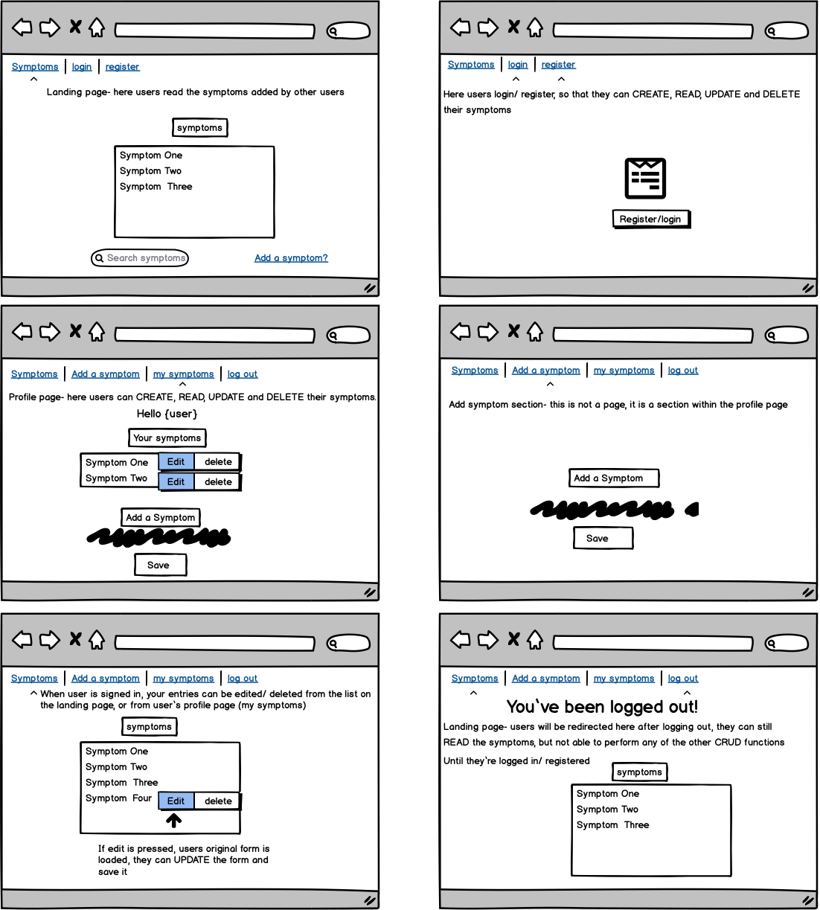

## Milestone 3 project

# Self-isolation watch
'Self-isolation watch' is designed to help people keep track of their symptoms and see what other users' symptoms are. They can add a symptom, description and the date they started feeling this way. 
This will help them keep a note of their potential retraction of the virus as well as give them an indication into how contagious they are. Users will be able to create a profile, where they save their symptoms, update them accordingly and when they are no longer symptomatic, they can delete them.' 

## Main Aims 
- To create an app that gives people a platform to share their symptoms and learn about each other.
- Take the pressure of a person to remember when they started feeling this way. 

## User Stories 
 
- 'As a recent self isolator, I want to keep track of what symptoms I have and how long I have had them so that I have more information to give to the doctor.'

- 'As a key worker, I want to browse through patients' symptoms, so that I can speed up diagnosis. '

- 'As a recent self isolator, I want to update the symptoms I have had so that I can find out how far from recovery I am.'

- 'As a recent self isolator, I want to read through other peoples symptoms and compare, so that I can find out if my symptoms are typical.'


## Personas 
- 'Someone at work has recently tested positive for covid-19, we must self isolate and track our symptoms (if any), I spend all day on my laptop if only there was an app where I could record my symptoms and the date I started feeling the symptoms too!' (Evelyn, 31, mother of 2 children under 5)

- 'It's so frustrating when patients come to me saying that they feel ill and they think they have COVID, but no note of when they started feeling ill! I wish they would bring me more information' (Jocelyn, 55, Nurse) 

- 'I feel terrible, but I don't know if it is just ...the flu I want to know if my symptoms are from COVID or something else. I'm conscious of all the fear-mongering and fake news out there..' (Luke, 28, Marketing manager)

## UX design process

### Design Process

#### Design Process: UX Research 
Initially, I had the idea to make an app which I would use in my career as a Personal Trainer, however, with the help of my wonderful [mentor]() I recognised that my emotional investment in the fruition of this project idea, was blocking my ability to see the importance of the functionality. It was also an idea, which required the user to already be aware of other such apps/ technology and was therefore not as accessible as the current idea I have run with. 

I went for a COVID test and in the booking stages, I was being asked about what symptoms I have had to make me think that I may have contracted the virus. 

This triggered my idea, I thought that the average person, may not be able to accurately track when they started experiencing symptoms and unless faced with a format that asked you the right questions, the person may not recognise the severity of their symptoms. 

I used the easy to understand the format of the [official gov- NHS site](https://www.gov.uk/get-coronavirus-test) and understood that user accessibilty was of the utmost importance. 

I knew that I wanted to create an app that would:
- Relieve the average person of the task of remembering what exactly their symptoms were and when they developed. 
- Provide a mechanism so that these symptoms could be updated/ deleted and created EASILY.
- Ensure that my design would tell users that this site is for functional use, but also that this is a tool to hopefully serve for a good outcome. 
- I was also adamant that I didn't want the site to be inundated with 'news' or 'information' forced upon the user. As we all know, the pandemic is a very emotional topic and causes unease for much of the population. 

I based my simplistic functional aspect of the app on the module-[mini-project-task-application]() expertly delivered by [code Institute](). Everything in this project is entirely fictionally and all content was created by me. 


#### Design process: UX Design

1. Strategy plane: According to healthcare professionals, one of the biggest strains, when having to diagnose a patient, is the lack of detail regarding the patients' symptoms. 
I deduced that this app could be used as a tool to directly lighten the workload of some of the hardworking front line staff that are in charge of diagnosing. 
From my experience as a British citizen, living throughout the tough times of 2020 and COVID-19, I have seen that amidst the chaos caused by the virus, it is very difficult to also keep track of your health. I hoped that this app would serve in helping people specify and track their potential COVID-19 symptoms and even spare a second to look at how they may be affecting their mental health and mood!

2. Scope plane: After deciding on who this app was aimed toward and how it would be benefiting them, I started to think of the features I would need to use to make sure the app fit the needs of the users. The user would have to be able to:
- **C** reate their symptoms
- **R** ead and view the symptoms of others, as a reference point of their own and for future development, potentially interact with a user who has a symptom that this user recognises and wants to offer advice on. 
- **U** pdate their symptoms, again the tracking of the progression or regression of symptoms will help significantly in the diagnosis process. 
- **D** elete their symptoms when they are no longer applicable.

I would input these key features into the design through the use of registration and login functionality, which would store the users' information, allowing for the above tasks to be carried out effectively. 

I also wanted to provide a search bar, for users to search through the list of symptoms. In addition to this, I wanted to ensure that I always had reinforcing messages/ prompts to let the user know what was happening, eg 'your symptom has been updated'.

3. Structure plane: I wanted to ensure that the structure of this app was data-centric. Therefore I wanted to limit the pages. I would have a registration/ login page and a homepage. Once the user was logged in / registered, the pages they could navigate between would be; add symptom, my symptoms, home page and logout. I wanted this structure so that users would find this app easy to use and functional. Based on the subject matter, I figured that less is more, I was sure that if they were aware that it was important to track their symptoms, they would have been inundated with plenty of information regarding covid. I didn't need to be another source. 

4. Skeleton plane: When deciding the above, I started to gauge the user experience up to this point. 
    1. The user would open the app, have a brief read of the limited content, provided for explanatory and instructional purposes. 
    2. scroll down to see a list of symptoms, (already added by other users), at this point they may choose that they want to have a thorough read through these entries. Or, they may want to search for a keyword, in the hopes that someone else has also experienced that same symptom. They could do either, I would provide a search box for them to do so. 
The list of symptoms will also be collapsible, showing only the headlines of the symptom entry; the symptom, the date the user started experiencing the symptom and who added it. 
If you click on it, then you will see the description of the symptom. I didn't want to make the isolation status of the person viewable, to anyone except the user whom the data belonged to. Politically, whether people are choosing to self-isolate, can be a huge source of contention and although a person could not be recognised from the username they have chosen, I wouldn't want the app to be the cause of any controversy moving forward. 
    3. as the user scrolls to the bottom of the page, they would see a footer, with a useful news link and the option to copy the site URL, so that they can share it with others. 
    4. Once registered, they would be taken to the my symptoms page and greeted with a welcome message including their username. Here they will see their current symptoms and have the option to add new symptoms. 
    5. I wanted them to see how easy the process of adding and editing their symptoms are, with reinforcing messages such as 'your symptom has been updated' and redirecting them to the list of their symptoms, viewable both on their profile (my symptoms tab) and the home page. 
    6. to make things faster, I wanted them to be able to edit/ delete on of their symptoms when viewing the list of symptoms on the homepage and on their profiles. 
    7. after inputting their data/ simply reading their current data, they will log off and be told they have been logged off. 
    8. whilst logged off, they still have the opportunity to view the symptoms on the homepage, but juts not add to them. 

5. Surface plane: 
    * Due to the nature of the app strategy. I was conscious that most images reflecting the topic could be triggering to users. I decided early on that I would not use any images, the colours would be uplifting but professional and I didn't want to lower the seriousness of the topic, with animations. 
    * In line with neutrality, I found it more effective to not have a logo, although there is scope for this in the future. 
    * I used [coolors](https://coolors.co/), to create a colour palette to work with, as shown below. I chose this palette as the colours were uplifting and warm yet formal, I felt this was the perfect balance of feelings to be evoked in users when visiting my app. I wanted them to feel hopeful that they were going to be okay, soothed that this app and tool exists, but also aware of the importance of their data. 

    * I used Roboto and quicksand from Google Fonts, for the fonts used throughout my project. I saw the two fonts used together on a peers MS3 project and thought together the fonts were informative yet approachable. 

    * I wanted to add a scroll-to-top button, which I had used in a previous project in this project as I felt it really added to smooth transition for the user. 

> Note: It was during the design process that I started to properly develop my idea. I was sure to keep referring to my user stories to ensure that I was meeting my criteria and my subsequent decisions made sense. 

### Design process

Selected colour palette:
### Colour scheme
It was important to me that the seriousness of the topic wasn't distracted from and the site was still inviting and palatable. For this reason i decided on 

Wireframes:



## Features
### Future Features 
- This list is limited to ' ' and they can click ' ' if they want to see the entire list.
- chat and share symptoms
## Features
### Future Features 
- This list is limited to ' ' and they can click ' ' if they want to see the entire list.
- chat and share symptoms
- line remains under page on nav bar to indictae what page you are on.
- images


### Existing Features
The app has 5 pages in total: symptoms, register, login, my symptoms, log out. on arrival to the app, symptoms, register and login are all that's available, once logged in, the user now sees, log out, my symptoms, symptoms and add symptom. 

Whilst building, I had 'add symptom' as a separate page, however, towards the end of building the site, I saw that it was possible and better UX to have the add symptom form on my symptoms/ profile page. I simply made the navigation link to add symptom, the id of the add symptom form, which is on the 'my symptoms' page. 

#### Database structure

The data for this project is stored in my MongoDB database within three collections as follows:
- *Users* - This collection stores the user's username and their encrypted password created when they signed up to self-isolation watch.
- *Symptoms* - When a user creates a symptom, it is stored within this collection with the following information: The username linking the symptom to their profile, the symptom name, the users' self-isolation status, description of their symptom, date from which they have been experiencing the symptom and their mood and mental health. 
- *Status* - The self-isolation status options are saved in separate documents within the status collection. The statuses are iterated through to provide the self-isolation status of the user when completing the form to add a symptom. 


#### Consistent features across all pages

- The menu at the top of the page and footer are consistent in design and responsive throughout the website. However, the menu changes depending on if a user is logged in or not.

- The menu bar differs depending on the user session.
 For users logged in reads as :
 
whereas the menu bar, if a user is not logged in/signed up says:


- In keeping with previous projects, I decided to have a footer for the app. I always found it a nice way of bringing the site together and adding to site uniformity.

- The footer features an icon to copy the URL for ease of sharing the app with friends and family. 
To do this I used clipboard.js (referenced below). When a user successfully copies the URL, they are notified with 'Copied!'  Equally, if the users' browser doesn't support the CDN and the action therefore fails, an alert tells the user the issue and explains how to manually copy the url to share it on. 

- scroll to top button,

- All flash messages appear with the same CSS.


#### symptoms (homepage)
- The user sees a few short sentences to welcome them in and to help them immediately understand what the purpose of this app is. There is then a link which when pressed takes the user to the register page. 

- as the user scrolls down, they see a list of the symptoms that have been previously added. 
- below the list of symptoms, there is a search box where the user can search through the list items using keywords that could be found in either the symptom_name / description fields of the MongoDB collection that the symptoms are located in. I achieved this function by following the steps from the Code Institue module, lesson ' '  
- on the list, they will see edit delete buttons on the items they have added. if they do either flash messages appear


### sign up  
- this page is pretty empty, there is nothing other than a form for the user to sign up. 
- if a person tries to sign up with an existing username a flash message appears, I decided no to do an error page for this as it is a human error often made because people click sign up instead of login. 
- if a person then remembers that they do have an account, they can also login from here top, using the login link next to the register button. 

### login
- this page is pretty empty, there is nothing other than a form for the user to login.
- if a person then remembers that they do not have an account, they can also sign up from here top, using the sign up link next to the login button. 
- if they are on trying to use a username that doesn't exist, if they are entering a password that doesn't exist or both, they are redirected to an error page. 
- the error page states the potential reasons for their failure to login and a link to try again. I wanted to use an error page here instead of a flash message because, I thought it was better defensive programming then telling a potential hacker, what exactly the issue was. 

### add symptom
- this page is not a page, rather a part of the 'my symptoms' page. 
- the 'add symptom' link leads the user directly to the 'add symptom' form.
-The form asks: I chose these questions because;

### my symptoms
- I wanted the user to see their current symptoms here, so provided a list of their user-specific symptoms, which from here they could edit or delete. 
- if they choose to delete any of their current symptoms, a modal is in place for them to confirm deleting. Again, this was good UX and defensive programming.
- if the user clicks edit, they will be taken to their symptom, with the fields filled out as was originally saved. they can edit or cancel. 
- if the user has no current symptoms, the alternative text will appear saying : 
 I didn't want to use a flash message here as I wanted the body text to be consistent and more persuasive. flash messages disappear and this text wouldn't until a new symptom was added. 

### logout
 - on logging out the user will see a flash message saying: and the user is directed back to the home page (symptoms)
 


# Bugs discovered

## - Password not encoding
### solution:
* Simply had forgotten to add the correct type to the password field on both register and login forms.


## - Jinja if statement and for loop, not functioning correctly 
* I wanted a title for the symptom list to appear on the 'my symtpoms' page, followed by the users' symptoms. If they did not have any symptoms, I wanted to provide text that prompts them to add one. I tried to execute this with 
```


<div class="row">
    <div class="col s12">
        <h2 class="subtitles">Here are your symptoms</h2>
    </div>
</div>



<div class="row">
    <div class="col s12">
        <h2 class="subtitles">Looks like you don't have any current symptoms!</h2>
        <p>
            Either you're a really healthy cookie.. or you havent got round to adding
            any yet!
        </p>
        <a href="#add_symptoms">Here's where you can add your symptoms!</a>
    </div>
</div>

```
However, when executing this code I was getting 
.png)
The correct text shows until I add a symptom and then the symptom displays, (which is correct) but I wanted the 'looks like you don't have any current symptoms' to disappear and be replaced with 'here are your symptoms'. 

* I changed the 
```  ``` to ```  ``` 
as 'symptoms' is the name of my variable, this resulted in .png). This was because i was using the 'symptoms' variable, which I had defined in the my_symptoms view. 
.png)
However, as you can see, that list has no filter and is calling all of the symptoms. Hence why 'here are your symptoms' appears the same number of times as there are total symptoms.

* I changed the symptoms variable to  ```symptoms = list(mongo.db.symptoms.find({"symptom_recipient": username}))`` so that it would now only show the list of the symptoms of that user on their 'my symptoms' page. 

* I then cleaned up the jinja template code 
``` <!--if statement stating which html to display and when  -->

    <div class="row">
        <div class="col s12">
            <h2 class="subtitles">Here are your symptoms</h2>
            <ul>
                
                    <li>
                        <h1 class="title">{{ symptom.symptom_name }}</h1>
                        <p>{{ symptom.description }}</p>
                        <h3 class="small-titles">
                            Experienced Since : {{ symptom.start_date}} added by : {{ symptom.symptom_recipient }}
                        </h3>
                        <a href="{{ url_for('edit_symptom', symptom_id=symptom._id) }}" class="btn-small green accented">Edit</a>
                        <!-- confirm delete modal -->
                        <a class="waves-effect waves-light btn modal-trigger" href="#delete-confirmation">Delete</a>
                        <div id="delete-confirmation" class="modal">
                            <div class="modal-content col s12">
                                <h4 class="subtitles">Are you sure you want to delete?</h4>
                            </div>
                            <div class="modal-footer">
                                <a href="{{ url_for('delete_symptom', symptom_id=symptom._id) }}" class="modal-close waves-effect waves-green btn-flat">Yes</a>
                                <a href="#!" class="modal-close waves-effect waves-green btn-flat">No</a>
                            </div>
                        </div>
                        <div class="divider deep-orange"></div>
                    </li>
                
            </ul>
        </div>
    </div>
<!--if there are no symptoms  -->    

    <div class="row">
        <div class="col s12">
            <h2 class="subtitles">Looks like you don't have any current symptoms!</h2>
            <p>
                Either you're a really healthy cookie.. or you havent got round to adding any yet!
            </p>
            <a href="#add_symptoms">Here's where you can add your symptoms!</a>
        </div>
    </div>
 
```
and no longer needed to define a condition for the session user. 

### solution:
* Adding a filter on the symptoms list within the app.py file and making the jinja code more formatted and clearer. 

## - Refresh causing null data input

* Everytime I was refreshing the page and logged in, a new input which was blank was being added to my mongo db. It was then also showing up on my page, as I was displaying all mongo.db entries. 
* tried to add an if statement syaing on form submit, only submit if its filled out correctly, but because my form is a dictionary this function doesnt work!
* added an if else statement to state that the post method means that the form should be be inserted and the get mehtod means that the current symptoms should simply display: 
```
@app.route("/add_symptom", methods=["GET", "POST"])
def add_symptom():
    **if request.method == "POST":**
        new_symptom = {
                "isolation_status": request.form.get("isolation_status"),
                "symptom_name": request.form.get("symptom_name"),
                "description": request.form.get("description"),
                "start_date": request.form.get("start_date"),
                "mood": request.form.get("mood"),
                "symptom_recipient": session["user"]
            }
        mongo.db.symptoms.insert_one(new_symptom)
        flash("Your symptom has been added!")
        return redirect(url_for(
            "my_symptoms", username=session['user']))
    else:
        status = mongo.db.status.find()
    return render_template("my_symptoms.html", status=status)

```

### solution:
* I added the if-else statement to the 'my symptoms' view as it was the view which was doing the actioning of adding a symptom. 

```
@app.route("/my_symptoms/<username>", methods=["GET", "POST"])
def my_symptoms(username):
    if request.method == "POST":
        new_symptom = {
            "isolation_status": request.form.get("isolation_status"),
            "symptom_name": request.form.get("symptom_name"),
            "description": request.form.get("description"),
            "start_date": request.form.get("start_date"),
            "mood": request.form.get("mood"),
            "symptom_recipient": session["user"]
        }
        mongo.db.symptoms.insert_one(new_symptom)
        return redirect(url_for(
            "my_symptoms", username=session['user']))
    else:
        username = mongo.db.users.find_one(
            {"username": session["user"]})["username"]
        status = mongo.db.status.find()
        symptoms = list(mongo.db.symptoms.find())
    return render_template(
        "my_symptoms.html",
        username=username, symptoms=symptoms, status=status)
        
```
## flash messages displaying with ``` [' '] ```

* I started trying to solve this issue by applying some CSS to the flash messages. This indeed made them more aesthetically pleasing but did not solve the issue. 
* I then began to do some research which threw up plenty of alternative options for writing a conditional statement and for loop for my flash messages to sit within, but none helped me. 
* Finally, I found a thread in slack of someone experiencing the same issue! 

### solution:
1. I simply had to change the 'messages' object in the curly brackets to singular. I realised that I had initially made this mistake, because I was thinking of it as, all the flash messages must follow this format, but in reality, I only want one message at a time and EACH message must follow the same conditions. 
```
<div class="row">

    
        
            <div class="col s12 flashes">
                <h3 class="center-align">{{messages}}</h3>
            </div>
        
    

</div>

```
```
<div class="row">

    
        
            <div class="col s12 flashes">
                <h3 class="center-align">{{message}}</h3>
            </div>
        
    

</div>

```
Proof of me working through this :
.png)
.png)
.png)
.png)


[More in depth testing can be found here](testing.md) 

## Known Bugs

### layout of footer not adhering to sizing rules
### 

## Deployment

This project was developed using Gitpod as the chosen IDE and GitHub as a remote repository. 

The deployed project can be viewed on the following link: 

The project's GitHub repository can be viewed with the following link: 

### Local deployment

If you would like to work on this project further you can clone it to your local machine using the following steps:

1. Scroll to the top of this repository and click on the "clone or download button"
2. Decide whether you want to clone the project using HTTPS or an SSH key and do the following:
    * HTTPS: click on the checklist icon to the right of the URL to copy it
    * SSH key: first click on 'Use SSH' then click on the same icon as above
3. Open a new Terminal window in your IDE of choice
4. Change the current working directory to the location where you want the cloned directory.
5. Enter the following command and press 'Enter' to create your local clone:
```
git clone 
```

6. Now create a Database that you intend to use for this cloned project with MongoDB.
7. Return to the Terminal and enter the following to install all required dependencies:
```
pip3 install -r requirements.txt
```
8. Create an env.py file with the following content, replacing the 'username','password', 'cluster_name' and 'database_name' with your MongoDB database values:
```
import os

os.environ["MONGO_URI"] = "mongodb+srv://<username>:<password>@<cluster_name>-ocous.mongodb.net/<database_name>?retryWrites=true&w=majority" 
```
9. Add your env.py file to .gitignore to make sure your database information is not viewable to others
10. Your cloned version is now ready to run locally with the following command:
```
python3 app.py
```

You can find both the source of this information and learn more about the process with the following link: [Cloning a Repository](https://help.github.com/en/github/creating-cloning-and-archiving-repositories/cloning-a-repository)

### Deploying this project to Heroku 

To deploy the project to Heroku, I used the following steps:

1. I created a Heroku account, signed in and created a new app with a unique name that had not already been taken (this project uses ' '). I then set the region to the closest to me: 'Europe'.
2. With the app created, I went to the 'Settings' tab and clicked the 'Reveal Config Variables' button. From here, I input the following values:
```
MONGO_URI: mongodb+srv://<username>:<password>@<cluster_name>-ocous.mongodb.net/<database_name>?retryWrites=true&w=majority
IP: 0.0.0.0
PORT: 5000
```
(Note: within the MONGO_URI value, I replaced the 'username','password', 'cluster_name' and 'database_name' with my specific database values. They are kept private for security reasons.)


3. In Gitpod, I created a requirements.txt file with the following command:
```
pip3 freeze --local > requirements.txt
```
4. I then created a Procfile with the following content within (making sure that 'Procfile' was written with a capitalized 'P'):
```
echo web: python app.py > Procfile
```
5. I then committed and pushed these new files with the following:
```
git add -A
```
```
git commit -m ""
```
```
git push
```
6. With these files committed and pushed, I navigated to the deployment tab on heroku.

7. I then clicked 'github' on the deployement method row.

8. When prompted, i typed the name of my git hub repo into the search box, ('self-isolation-watch') 

9. When my repo appeared I clicked it.

10. I then scrolled down towards the deploy button and clicked 'enable automatic deployment'.

11. finally i clicked deploy! 

12. to ensure that my app had successfully been deployed i clicked open app and saw the text 'hello world' which i had used as a test and returned within my first view in my app.py folder. 


This completed the process of deploying the project to Heroku. Once deployed, I continued to push all changes made to the project to Heroku throughout the remaining development process.

## Credits

### Content

The content of this website is entirely fictional and written by myself.

### Images


### Acknowledgements

Thank you to the following people who helped with support and inspiration:
[Nick bell]() 
[Miranda](), read me structure


### credits

[helpful link for copy to clipboard function](https://clipboardjs.com/)

[scroll up js from previous project](https://github.com/mayasaffron/PT-n-Podcaster/blob/master/assets/js/index.js)